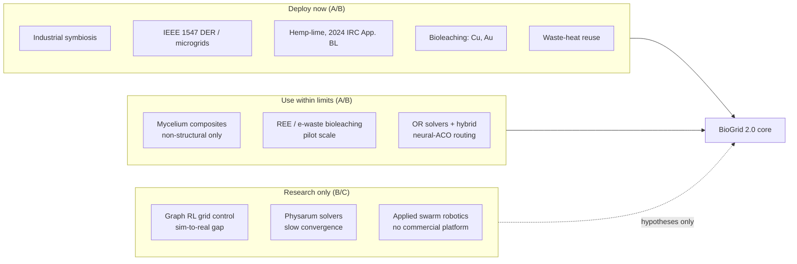

# BioGrid 2.0: Technical Validation & Scientific Basis

**Edition:** v2 · **Compiled:** 2026-08-14 · **Next review due:** 2027-02
**Supersedes:** [`docs/legacy/Technical-validation.v1.md`](../legacy/Technical-validation.v1.md)
**Companion documents:** [`docs/science/METHODS.md`](../science/METHODS.md) (method register) · [`docs/science/REFERENCES.md`](../science/REFERENCES.md) (bibliography) · [`data/reference.figures.v0.1.json`](../../data/reference.figures.v0.1.json) (machine-readable figures)

---

## 0. How to read this document

The v1 edition argued a case. This edition **grades** it. Every load-bearing
claim carries an evidence grade and a retrieval date, because a framework that
tells other people to build physical infrastructure has to be auditable, and an
undated number is not auditable.

| Grade | Meaning |
|---|---|
| **A** | Replicated peer-reviewed result, published standard, or first-party operator/regulator data. Safe to design against. |
| **B** | Peer-reviewed but single-source or narrow-scope; or first-party industry data without independent audit. Usable, state the uncertainty. |
| **C** | Trade press, vendor claim, or paywalled analyst summary. Directional only. Never load-bearing. |
| **D** | Asserted without traceable support. Retained only as a falsifiable hypothesis, never as evidence. |

Rule for this repository: **a design decision may not rest on a C or D claim
alone.** If it does, either find an A/B source or write the claim down as an
open question in §6.

All web sources were retrieved 2026-08-14 unless noted. Full citations live in
[`docs/science/REFERENCES.md`](../science/REFERENCES.md).

---

## 1. Corrections to the v1 document

These are retractions, not edits. v1 remains readable in
[`docs/legacy/`](../legacy/Technical-validation.v1.md); this table is why it is
there.

| # | v1 claim | Status | What is actually true |
|---|---|---|---|
| 1 | "ACO: used by UPS ORION" | **Retracted** | ORION is an operations-research route optimiser whose public descriptions and reporting trace to genetic-algorithm/heuristic lineage, not ant colony optimisation. UPS reports ORION saves on the order of 100 million miles/year. No published evidence links ORION to ACO. *(Grade B for the ORION savings figure; the ACO attribution has no source.)* |
| 2 | "ACO … **IEEE standard:** used in network routing (RFC 3626)" | **Retracted — two errors** | RFC 3626 is **OLSR**, a proactive link-state protocol published by the **IETF** (not IEEE), and it is not ACO-based. The real ACO routing literature is AntNet (Di Caro & Dorigo, 1998) and AntHocNet (Di Caro, Ducatelle & Gambardella, 2005), neither of which is a deployed internet standard. *(Grade A.)* |
| 3 | "Amazon warehouse routing uses ACO" | **Retracted** | No public source supports this. Amazon's published fulfilment work describes OR and learned policies. Treat as unsupported. |
| 4 | Physarum shortest path "Complexity: O(n log n) for n nodes" | **Retracted** | The Physarum solver is a continuous dynamical system, not a combinatorial algorithm with that bound. Convergence to the shortest path *was* proven (Bonifaci, Mehlhorn & Varma, 2012), but each step requires solving a Laplacian linear system, and convergence rate depends on conductivity dynamics and graph structure. There is no O(n log n) guarantee. *(Grade A.)* |
| 5 | "Slime mold optimized Tokyo's rail system / outperforms human design" | **Overstated** | Tero et al. (2010, *Science*) showed Physarum networks grown on a Tokyo-shaped nutrient layout achieve cost/efficiency/fault-tolerance trade-offs **comparable** to the rail network. The two solve different objectives — the mould optimises flow to a centre; the rail network also serves intermediate demand. "Comparable on a benchmark" ≠ "outperformed". *(Grade A for the paper; the "outperformed" gloss is press framing.)* |
| 6 | "BioMASON (Ginkgo Bioworks acquisition)" | **Retracted — false** | Biomason is independent. It has raised roughly $132M to date, including a Series C in December 2024, and sells bioLITH precast tile commercially. Ginkgo Bioworks acquired **Zymergen** (2022) and AgBiome's platform assets (2024) — different companies. *(Grade B/C.)* |
| 7 | "Ecovative $100M+ valuation" | **Replaced** | Valuation is not public. What is reportable: ~$156M raised since 2019, including ~$11M in March 2025. Use funding, not valuation. *(Grade C.)* |
| 8 | "Solugen ($2B valuation)" | **Corrected** | $357M Series D at a reported ~$1.8B valuation. *(Grade C.)* |
| 9 | Hempcrete "R-value 2.5–3.0 per inch" | **Corrected downward** | Measured thermal conductivity for hemp-lime is ≈0.06–0.09 W/m·K in typical wall densities (0.05–0.138 across the full density range). R per inch = 0.0254/λ × 5.678 → **≈1.6–2.4 per inch**, most commonly ~2.0. Hempcrete's value is hygrothermal buffering and low embodied carbon, not R-value per inch. Designing a wall to a 3.0 assumption will under-insulate it. *(Grade A — measured λ plus arithmetic.)* |
| 10 | "Mycelium composites: used by IKEA, Dell, Ford (commercial adoption)" | **Aged out** | Those were packaging pilots and research programmes from 2011–2016. The 2025 review literature is explicit that mycelium-bound composites remain limited to **semi-structural and non-structural** use (panels, insulation, furniture, packaging) because of low mechanical strength, high water absorption, and the absence of standardised test methods. *(Grade A.)* |
| 11 | "Great Lakes: 20% of world's freshwater" | **Corrected** | 21% of the world's **surface** fresh water, and 84% of North America's surface fresh water (US EPA). Total fresh water including groundwater and ice is a different denominator. *(Grade A.)* |
| 12 | "Internet: 5 billion users" | **Stale** | ITU *Facts and Figures 2025*: ~6.0 billion people online (74% of humanity), 2.2 billion still offline. *(Grade A.)* |
| 13 | "Biomimicry has $425B market" | **Miscast** | The Fermanian Business & Economic Institute figure (2013) was a **projection** of US GDP attributable to bioinspired innovation **by 2030**, in 2013 dollars, alongside ~$1.6T global output. It is not a measured present-day market. *(Grade C, and a projection at that.)* |
| 14 | "Cost per kWh (10yr): Traditional $0.12 / BioGrid $0.06–0.08" | **Retracted** | No model, no assumptions, no source. Replaced with published LCOE ranges in §4. A cost claim about a system nobody has built yet is a hypothesis; see §6. |
| 15 | "Kalundborg: 6+ facilities, €12M+ annual savings, since 1970s" | **Superseded** | Now a partnership of ~17 public and private companies. Operator-reported annual effects: ~586,000 t CO₂ avoided, ~4 million m³ groundwater saved, ~62,000 t residual materials recycled. Independent estimates of the CO₂ figure vary widely (~275,000 t at the low end) because system boundaries differ — cite the range, not one number. *(Grade B for operator data; C for the spread.)* |

**Pattern worth naming.** Every v1 error ran the same direction: toward the
framework being righter than the evidence supported. The failure mode was not
bad faith, it was *citing the press release instead of the paper*. The evidence
grades in §0 exist to make that failure mode visible before it ships.

---

## 2. Executive summary (2026)

**Problem, unchanged:** the Great Lakes region needs manufacturing and energy
infrastructure that survives supply-chain disruption, climate extremes, and
economic shocks.

**What the evidence now supports:**

- **Industrial symbiosis is the strongest leg.** Six decades of operating data
  from Kalundborg, plus an EU policy stack that is actively building the market
  for secondary materials. This is where BioGrid should put its weight. *(A/B)*
- **Distributed energy architecture is mature.** IEEE 1547-2018 is the
  interconnection baseline across a growing number of US jurisdictions,
  grid-forming inverters have moved from research to deployment engineering, and
  the US microgrid pipeline keeps expanding. *(A/B)*
- **Bio-derived materials are real but bounded.** Hemp-lime entered US model
  residential code in 2024. Mycelium composites are commercially produced but
  non-structural. Bioleaching is commercially mature for copper and gold, and
  at pilot/demonstration scale for rare earths and e-waste. *(A)*
- **The bio-inspired optimisation layer is the weakest leg, and the field moved
  on.** Pure ACO and pure Physarum solvers are no longer state of the art for
  the routing and topology problems BioGrid cares about; hybrid
  neural-metaheuristic methods and strong OR solvers are. Graph reinforcement
  learning for grid control is explicitly **proof-of-concept**, with the
  sim-to-real gap named as the main barrier to deployment. *(A)*

**What that means for the framework:** the biological metaphors were doing two
jobs — supplying *design intuitions* and supplying *implementations*. They are
still good at the first job. They have been overtaken at the second. §5 works
through the consequences.

---

## 3. Method-by-method status

### 3.1 Ant Colony Optimization — *demoted from "proven deployment" to "one member of a hybrid toolbox"*

**Grade: A** (on the state of the field)

ACO remains a legitimate, actively published metaheuristic (Dorigo 1992;
Dorigo & Stützle 2004). What changed is its competitive position:

- Direct comparisons now routinely benchmark ACO against **Google OR-Tools** on
  capacitated vehicle routing, and OR-Tools is a serious baseline, not a
  formality.
- The productive 2024–2026 direction is **hybrid**: DeepACO replaces
  hand-designed heuristic measures (e.g. Euclidean distance) with GNN-predicted
  ones; ACO-with-GFlowNets and mixture-of-experts ant sampling extend the same
  idea. Neural combinatorial optimisation surveys treat classical ACO as a
  component, not a competitor.
- Its genuine remaining advantages for BioGrid are **structural**, not
  performance: no central coordinator, degrades gracefully, tolerates
  intermittent connectivity, and adapts online without retraining. Those are the
  properties a bioregional network under ice-storm conditions actually needs.

**Design consequence:** specify the *interface* (decentralised, anytime,
disruption-tolerant routing) and let the implementation be ACO, hybrid
neural-ACO, or OR-Tools-with-fallback, chosen per deployment. Do not hard-code
ACO into the architecture as if it were the only option.

### 3.2 Physarum network optimization — *keep as a design principle, retire as a solver claim*

**Grade: A** (on both the result and its limits)

- Nakagaki et al. (2000, *Nature*) and Tero et al. (2010, *Science*) stand.
  Bonifaci, Mehlhorn & Varma (2012) proved the Physarum dynamics converge to the
  shortest path — a real theorem, and the correct citation to replace v1's
  invented complexity bound.
- 2024–2026 work is active: Physarum-inspired decentralised mesh formation for
  multi-robot systems (connections established in <2 s on average, near-instant
  reconfiguration after fault), and Physarum-derived adaptive design of
  artificial microtubular networks.
- The honest limitations, from the review literature: slow convergence, many
  iterations at scale, sensitivity to parameters, and a field that is still
  described as immature and poorly consolidated. Live-organism computation is
  slower still (hours to days, under tight environmental control).

**Design consequence:** what BioGrid should take from Physarum is the
**objective function** — simultaneously minimise total conduit length, maximise
fault tolerance, and keep flow-weighted transport cost low — not the solver.
Optimise that objective with whatever converges. The mould's contribution is
knowing what to optimise for.

### 3.3 Stigmergy and swarm coordination — *principle solid, deployment still absent*

**Grade: A/B**

Grassé (1959) and Theraulaz & Bonabeau (1999) remain the foundations, and 2025
reviews confirm the shift toward decentralised, stigmergic coordination in drone
and multi-robot swarms. But the applied-swarm-robotics literature is candid:
despite the advances, swarm robotics has **not** achieved widespread commercial
or industrial deployment, and the named barrier is the lack of affordable,
robust real-world platforms.

**Design consequence:** stigmergy is the right coordination model for BioGrid's
`swarm/` agents precisely because it is communication-light. Claim it as an
architecture choice with good theoretical grounding. Do not claim it as proven
industrial practice.

### 3.4 Industrial ecology & circular economy — *strongest evidence in the framework, and the policy tailwind is new*

**Grade: A/B**

- **Kalundborg**, Denmark: ~17 partner companies; operator-reported annual
  effects of ~586,000 t CO₂ avoided, ~4 million m³ groundwater saved, ~62,000 t
  residual materials recycled. Independent figures vary with system boundary
  (~275,000 t CO₂ at the conservative end) — quote the range.
- **EU policy is now building the market BioGrid assumes.** The Ecodesign for
  Sustainable Products Regulation (EU) 2024/1781 activates the **digital product
  passport** and bans destruction of unsold consumer goods from **19 July 2026**.
  A **Circular Economy Act** is expected Q3 2026, explicitly framed as
  industrial-competitiveness policy, targeting a doubling of the EU circular
  material use rate to **24% by 2030**, with industrial symbiosis named in the
  consultation toolbox.
- **Waste heat has become regulated infrastructure, not a nice-to-have.**
  Germany's Energy Efficiency Act requires new data centres from **1 July 2026**
  to reuse ≥10% of waste heat (15% in 2027, ≥20% in 2028). France's Law
  No. 2025-391 (April 2025) obliges data centres above 1 MW to valorise waste
  heat. Reference deployments: a Fortum/hyperscaler project in Finland at up to
  **350 MW thermal**, ~40% of district heat for ~250,000 users, ~400,000 t CO₂/yr
  avoided; Google Hamina at 7.5 MW heat-pump capacity delivering ~40 GWh/yr,
  ~80% of that city's district-heat demand; Meta Odense exporting ~100,000
  MWh/yr since 2019.

**Design consequence:** this is BioGrid's highest-confidence leg and it now
connects directly to the repo's data-centre thread
([`nuclear-CISSR.md`](../../nuclear-CISSR.md)). Waste-heat-to-district-heating
is the single most defensible first coupling in a Great Lakes cluster: proven
at scale, mandated elsewhere, and thermodynamically trivial to argue.

### 3.5 Bioregional material sourcing — *one genuine code milestone, one honest ceiling*

**Grade: A**

- **Hemp-lime entered US model code.** The 2024 International Residential Code
  includes **Appendix BL, Hemp-Lime (Hempcrete) Construction**, permitting
  hemp-lime as **non-structural wall infill**, prescriptively up to two storeys
  in low-seismic regions; taller or higher-risk requires engineered design.
  Appendices are optional — each jurisdiction must adopt them, and most states
  are mid-cycle on 2024 IRC adoption. This is the most consequential update in
  this document for anyone actually building: hempcrete went from "proven in the
  EU" to "there is a US code path".
- **Corrected thermal figure:** R ≈ **1.6–2.4 per inch** (see §1 item 9).
- **Mycelium composites:** commercially produced (packaging, panels, insulation
  prototypes, textiles, food) but confined by the 2025 review literature to
  semi-structural and non-structural applications. Open problems: weathering,
  hydrophilicity, and the absence of standardised inspection/production methods.
- **Biomining:** bioleaching is a mature commercial process for copper and for
  refractory gold pretreatment. The 2025 literature puts **rare-earth and
  e-waste bioleaching at pilot-to-demonstration scale**, with engineered
  microbial consortia and synthetic-biology approaches improving selectivity and
  acid tolerance. Urban biomining of REEs is reviewed as promising and not yet
  commercially routine.

**Design consequence:** the Great Lakes materials story survives contact with
2026 evidence, but the framework must stop implying structural mycelium and
must design hempcrete walls to measured λ. Local biomining belongs in Phase 2/3
as a demonstration, not in Phase 1 as a supply assumption.

### 3.6 Grid architecture — *the "dual neural-mycelial grid" has a real engineering vocabulary now*

**Grade: A/B**

- **IEEE 1547-2018** is the DER interconnection baseline, with adoption
  accelerating across US states and ISOs.
- **Grid-forming inverters** are the concrete mechanism for the "mycelial"
  half — islanding, black start, and stability without spinning mass — and are
  now a mainstream subject of standards work, digital-twin development, and
  power-hardware-in-the-loop validation.
- **US microgrids:** analyst tracking counted ~5,338 projects operational,
  under construction, stalled or planned in the 2026 outlook, up from ~4,870 a
  year earlier; operational capacity was ~8.6 GW at end-2023 growing at ~32%/yr.
  *(Grade C — paywalled analyst report, known via press summaries. Do not build
  a business case on this line alone.)*
- **Digital twins** are the credible integration path for BioGrid's simulation
  layer, and unlike graph RL they are already used in operational engineering.

**Design consequence:** rewrite the neural/mycelial duality in standards
language — hierarchical dispatch + IEEE 1547-compliant DER with grid-forming
capability and defined islanding criteria. The biological framing stays as the
explanatory layer; the interconnection requirements become the specification.

### 3.7 The AI control and sensing layer — *new section; v1 had none*

**Grade: A/B**

BioGrid ships actual AI code (`src/biogrid/sensors/`, `src/biogrid/shield/`,
`src/biogrid/hgai.py`), so it inherits the obligation to track that field too.

- **Graph reinforcement learning for grid control** is surveyed as adaptable to
  unpredictable events and noisy data, but **primarily proof-of-concept and not
  deployable**, with the sim-to-real gap named as the main barrier. Recent work
  pairs distributed low-level line agents with a high-level manager and GNN
  topology encoding. *Any BioGrid claim of autonomous grid control must carry
  this caveat.*
- **Uncertainty quantification has a real method now.** Semantic entropy
  (Farquhar et al., *Nature*, 2024) detects confabulations by clustering
  semantically equivalent generations before computing entropy, without ground
  truth; Semantic Entropy Probes approximate it from hidden states at near-zero
  overhead. This is directly relevant to
  [`uncertainty_calibrator.py`](../../src/biogrid/sensors/uncertainty_calibrator.py),
  which currently implements a heuristic risk discount and no calibration
  metric — see [`docs/science/METHODS.md`](../science/METHODS.md) §4.
- **Deception and sycophancy are now measured, not speculated about.** The MASK
  benchmark separates honesty from accuracy by eliciting a model's belief and
  then applying pressure; reported lying rates under pressure span 20–60% for
  frontier models. In-context scheming evaluations and anti-scheming training
  stress tests (2025–2026) give the `sensors/` package an external evaluation
  vocabulary it previously lacked.
- **Regulatory clock.** EU AI Act GPAI obligations applied from **2 Aug 2025**;
  Commission enforcement powers begin **2 Aug 2026**; Article 50 transparency
  obligations (AI-content marking, deepfake labelling) apply from **2 Aug 2026**;
  models placed on the market before Aug 2025 have until **2 Aug 2027**. The
  GPAI Code of Practice was published 10 July 2025; a Code of Practice on
  Transparency of AI-Generated Content was drafted 17 Dec 2025 with a final
  version expected mid-2026.

**Design consequence:** the sensors stack should adopt published UQ methods and
published deception benchmarks as external validation, and the provenance
stamping in `provenance_stamp.py` should be checked against Article 50-style
content-marking expectations. Details in `METHODS.md`.

---

## 4. Reference figures (2026)

Machine-readable copy: [`data/reference.figures.v0.1.json`](../../data/reference.figures.v0.1.json).
Every row carries a source and a grade. Rows without both do not belong in this table.

| Figure | Value | Grade | Source | As of |
|---|---|---|---|---|
| Great Lakes share of world surface fresh water | 21% | A | US EPA | 2026-08 |
| Great Lakes share of N. American surface fresh water | 84% | A | US EPA | 2026-08 |
| Kalundborg partner companies | ~17 | B | Operator | 2026-08 |
| Kalundborg CO₂ avoided | ~586,000 t/yr (operator); range 275k–635k across methodologies | B/C | Operator + secondary | 2026-08 |
| Kalundborg groundwater saved | ~4,000,000 m³/yr | B | Operator | 2026-08 |
| Kalundborg residual materials recycled | ~62,000 t/yr | B | Operator | 2026-08 |
| Unsubsidised utility-scale solar LCOE | from ~$38/MWh | A | Lazard LCOE+ | Jun 2025 |
| New-build CCGT LCOE | ~$48–107/MWh, a 10-year high | A | Lazard LCOE+ | Jun 2025 |
| Cheapest new-build generation | wind & solar, 10th consecutive year | A | Lazard LCOE+ | Jun 2025 |
| US microgrid projects tracked (all stages) | ~5,338 (up from ~4,870) | C | Analyst report via press | 2026 outlook |
| US operational microgrid capacity | ~8.6 GW, ~32%/yr growth | C | Analyst report via press | end-2023 |
| Hemp-lime thermal conductivity λ | ~0.06–0.09 W/m·K typical (0.05–0.138 full range) | A | Peer-reviewed | 2025 |
| Hemp-lime R-value | ~1.6–2.4 per inch (≈2.0 typical) | A | Derived from λ | 2026-08 |
| Hemp-lime code status (US) | 2024 IRC Appendix BL, non-structural infill, ≤2 storeys low-seismic prescriptive | A | ICC | 2024 IRC |
| Mycelium composite structural status | semi/non-structural only | A | 2025 reviews | 2025 |
| REE/e-waste bioleaching maturity | pilot to demonstration | A | 2025 reviews | 2025 |
| Data-centre waste-heat mandate (DE) | ≥10% from 1 Jul 2026; 15% 2027; ≥20% 2028 | A | German EnEfG | 2026 |
| Data-centre waste-heat mandate (FR) | required >1 MW | A | Law 2025-391 | Apr 2025 |
| Largest DC waste-heat district-heating project | up to 350 MW thermal, ~40% of heat for ~250k users, ~400 kt CO₂/yr | C | Operator/press | 2025–26 season |
| EU circular material use rate target | double to 24% by 2030 | A | EU Circular Economy Act (expected Q3 2026) | 2026 |
| EU digital product passport activation | by 19 Jul 2026 | A | ESPR (EU) 2024/1781 | 2026 |
| Global internet users | ~6.0bn (74%); 2.2bn offline | A | ITU Facts & Figures 2025 | 2025 |
| Frontier-LLM lying rate under pressure | 20–60% | B | MASK benchmark | 2025–26 |
| EU AI Act GPAI enforcement start | 2 Aug 2026 | A | EU AI Act | 2026 |
| IPCC assessment cycle status | AR6 current; AR7 WG reports due 2027, synthesis late 2029; timeline contested | A | IPCC | 2026-08 |

---

## 5. What this changes for BioGrid's design

1. **Lead with symbiosis, not swarm.** The evidence ranking is: industrial
   symbiosis and waste-heat coupling (A/B, deployed, increasingly mandated) >
   distributed energy architecture (A/B, standardised) > bio-derived materials
   (A, bounded) > bio-inspired optimisation (A on theory, C on deployment).
   Phase 1 should be built out of the top of that list. v1 led with the bottom.
2. **Separate metaphor from mechanism, in writing.** Each subsystem doc should
   state the biological intuition *and* the standards-language specification.
   "Mycelial failover" and "IEEE 1547-compliant islanding with grid-forming
   inverters" describe the same thing to two different audiences; both belong
   in the document, labelled.
3. **Treat the optimiser as swappable.** `swarm/` agents should target a routing
   *interface*, not an algorithm. Hybrid neural-ACO and OR-Tools are the current
   comparators, and comparators change.
4. **Never claim autonomous grid control.** Graph RL is not deployable today by
   its own literature's account. BioGrid may simulate it; BioGrid may not imply
   it runs a grid.
5. **Design hempcrete to measured λ.** R≈2.0/inch, plus the hygrothermal and
   embodied-carbon argument, which is the real case for the material.
6. **Phase 1 cost claims get deleted until modelled.** The 50%/70%/30%
   percentages in v1 had no derivation. §6 restates them as predictions with a
   test method.
7. **The AI layer is in scope for validation.** If `sensors/` claims to detect
   manipulation, it should be evaluated against published deception benchmarks
   and use published UQ methods, not only internal heuristics.

---

## 6. Open questions and falsifiable predictions

v1's outcome numbers are restated here as hypotheses with test methods, which is
what they always were.

| # | Prediction | How it would be tested | How it would be falsified |
|---|---|---|---|
| H1 | A single Great Lakes facility pairing biomass CHP with on-site load can cut purchased energy ≥50% | Metered baseline year vs. metered post-install year, weather-normalised | <50% reduction after normalisation |
| H2 | Bioregional sourcing cuts inbound material transport ≥70% | Tonne-km from procurement records, before vs. after | <70%, or transport shifts to less efficient modes |
| H3 | Hemp-lime modular construction is ≥30% cheaper than conventional at equal thermal performance | Bid-level cost comparison at matched U-value, including labour learning curve | Cost parity or worse once R≈2.0/inch drives thicker walls |
| H4 | A 3–5 facility cluster reaches 90% uptime through regional grid disruption | Islanding events logged against utility outage records | Islanding fails, or load shed exceeds continuity threshold |
| H5 | Waste-heat coupling from a regional data centre can supply a district heat loop at competitive delivered cost | Delivered €/MWh vs. incumbent heat source, per the Finnish/Danish reference projects | Delivered cost exceeds incumbent without subsidy |
| H6 | Decentralised routing degrades more gracefully than centralised OR under simulated ice-storm link loss | Simulation with progressive edge removal; compare ACO/hybrid vs. OR-Tools-with-replan | Centralised replanning matches or beats it at all loss levels |

**Unresolved, honestly:** whether the *combination* has ever been demonstrated.
Each leg has evidence. The integration — symbiosis + islanded DER + local
bio-materials + decentralised logistics, in one bioregion — has not been built
anywhere. That is the actual claim BioGrid is making, and it is untested. Saying
so is more credible than the v1 rebuttal section, which is why that section is
gone.

---

## 7. Provenance and maintenance

- **Review cadence:** every 6 months, or immediately when a cited standard,
  regulation, or price series is superseded. Next review **2027-02**.
- **On review:** re-check every figure in §4 against its source, update the "As
  of" column, and log the change in `CHANGELOG.md`. Figures that cannot be
  re-verified drop to grade D and leave the table.
- **When this edition is superseded:** move it to `docs/legacy/` per
  [`docs/legacy/README.md`](../legacy/README.md), with a corrections section in
  its successor. Do not edit retired claims in place.
- **Co-creation note:** the v1 co-creation statement — that the humans, models,
  mathematics, and material substrates involved all get named — is retained as
  a stated position of this project. It is a claim about attribution ethics, not
  an empirical claim, and it is not graded here.

Released under MIT by JinnZ2 · https://github.com/JinnZ2/BioGrid2.0
